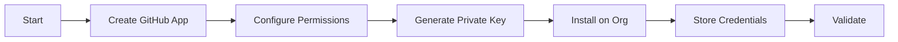

# GitHub App Agent

## Task
Create and configure GitHub App for platform automation.

## Skills Reference
- **[github-cli](../../skills/github-cli/)** - GitHub operations
- **[validation-scripts](../../skills/validation-scripts/)** - App validation

## Workflow



## Commands

### Setup Script
```bash
./scripts/setup-github-app.sh \
  --app-name "three-horizons-platform" \
  --org ${GITHUB_ORG}
```

### Store App Credentials
```bash
# Store in Key Vault
az keyvault secret set \
  --vault-name ${KEY_VAULT} \
  --name "github-app-id" \
  --value "${APP_ID}"

az keyvault secret set \
  --vault-name ${KEY_VAULT} \
  --name "github-app-private-key" \
  --value "$(cat private-key.pem)"
```

## Required Permissions

| Permission | Access | Purpose |
|------------|--------|---------|
| Contents | Write | Clone, push code |
| Pull requests | Write | Create, merge PRs |
| Issues | Write | Create, update issues |
| Actions | Write | Trigger workflows |
| Checks | Write | Report status checks |

## Parameters

| Parameter | Required | Default | Description |
|-----------|----------|---------|-------------|
| app_name | Yes | - | GitHub App name |
| org | Yes | - | GitHub organization |
| permissions | No | default | Permission set |

## Dependencies
- GitHub organization admin access

## Triggers Next
- `identity-federation-agent` (OIDC for Actions)
- `github-runners-agent` (Self-hosted runners)
