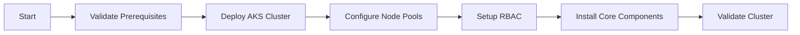

# Infrastructure Agent (AKS)

## Task
Deploy and configure Azure Kubernetes Service (AKS) cluster with enterprise configurations.

## Skills Reference
- **[azure-infrastructure](../../skills/azure-infrastructure/)** - AKS cluster provisioning
- **[kubectl-cli](../../skills/kubectl-cli/)** - Kubernetes operations
- **[terraform-cli](../../skills/terraform-cli/)** - Infrastructure as code
- **[validation-scripts](../../skills/validation-scripts/)** - Cluster validation

## Workflow



## Commands

### Deploy AKS
```bash
cd terraform/environments/${ENV}
terraform plan -target=module.aks_cluster -out=aks.tfplan
terraform apply aks.tfplan
```

### Get Credentials
```bash
az aks get-credentials \
  --resource-group ${RESOURCE_GROUP} \
  --name ${AKS_NAME} \
  --admin
```

### Validate
```bash
kubectl get nodes
kubectl get pods -A
./scripts/validate-deployment.sh --component aks
```

## Parameters

| Parameter | Required | Default | Description |
|-----------|----------|---------|-------------|
| environment | Yes | - | dev, staging, prod |
| kubernetes_version | No | 1.29 | K8s version |
| node_count | No | 3 | Initial node count |
| node_size | No | Standard_D4s_v3 | VM size |

## Dependencies
- `networking-agent` (VNet/subnets)
- `security-agent` (Key Vault, identities)
- `container-registry-agent` (ACR for images)

## Triggers Next
- `gitops-agent` (ArgoCD installation)
- `observability-agent` (Monitoring stack)

## Platform Choice
For **ARO** instead of AKS, use `aro-platform-agent`.
