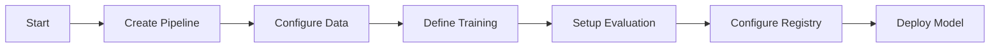

# MLOps Pipeline Agent

## Task
Configure ML training pipelines and model deployment automation.

## Skills Reference
- **[ai-foundry-operations](../../skills/ai-foundry-operations/)** - ML pipeline operations
- **[github-cli](../../skills/github-cli/)** - CI/CD integration
- **[validation-scripts](../../skills/validation-scripts/)** - Pipeline validation

## Workflow



## Commands

### Create Training Pipeline
```bash
az ml job create \
  --file training-pipeline.yaml \
  --workspace-name ${WORKSPACE} \
  --resource-group ${RG}
```

### Register Model
```bash
az ml model create \
  --name ${MODEL_NAME} \
  --path ./outputs/model \
  --type mlflow_model
```

### Create Endpoint
```bash
az ml online-endpoint create \
  --name ${ENDPOINT_NAME} \
  --file endpoint.yaml
```

## Pipeline YAML Example
```yaml
$schema: https://azuremlschemas.azureedge.net/latest/pipelineJob.schema.json
type: pipeline
experiment_name: training-experiment
jobs:
  train:
    type: command
    component: ./components/train.yaml
    inputs:
      data: ${{parent.inputs.training_data}}
  evaluate:
    type: command
    component: ./components/evaluate.yaml
    inputs:
      model: ${{parent.jobs.train.outputs.model}}
```

## Parameters

| Parameter | Required | Default | Description |
|-----------|----------|---------|-------------|
| workspace | Yes | - | AI Project workspace |
| pipeline_type | Yes | - | training, evaluation |
| compute | No | cpu-cluster | Compute target |

## Dependencies
- `ai-foundry-agent` (AI Hub/Projects)

## Triggers Next
- Model deployments via endpoints
