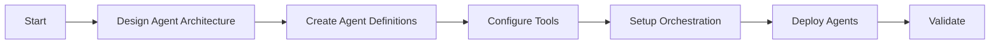

# Multi-Agent Setup Agent

## Task
Configure multi-agent AI orchestration using Azure AI Foundry.

## Skills Reference
- **[ai-foundry-operations](../../skills/ai-foundry-operations/)** - Agent configuration
- **[validation-scripts](../../skills/validation-scripts/)** - Agent validation

## Workflow



## Agent Architecture Patterns

### Hierarchical Pattern
```
Orchestrator Agent
├── Research Agent
├── Analysis Agent
└── Response Agent
```

### Collaborative Pattern
```
User Query → Router Agent
             ├── Domain Agent A
             ├── Domain Agent B
             └── Synthesis Agent → Response
```

## Configuration Example
```yaml
agents:
  - name: orchestrator
    model: gpt-4o
    system_prompt: |
      You are an orchestrator that delegates tasks.
    tools:
      - delegate_to_research
      - delegate_to_analysis
      
  - name: research
    model: gpt-4o-mini
    tools:
      - web_search
      - document_retrieval
```

## Parameters

| Parameter | Required | Default | Description |
|-----------|----------|---------|-------------|
| agent_count | Yes | - | Number of agents |
| orchestration | No | hierarchical | Pattern type |
| model | No | gpt-4o | Default model |

## Dependencies
- `ai-foundry-agent` (AI Hub/Projects)

## Triggers Next
- `sre-agent` (Operational AI agents)
