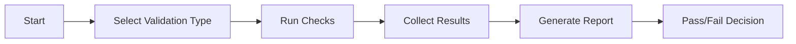

# Validation Agent

## Task
Validate infrastructure deployments and application configurations.

## Skills Reference
- **[validation-scripts](../../skills/validation-scripts/)** - Validation patterns
- **[terraform-cli](../../skills/terraform-cli/)** - State validation
- **[kubectl-cli](../../skills/kubectl-cli/)** - Cluster validation

## Workflow



## Commands

### Full Validation
```bash
./scripts/validate-deployment.sh --all
```

### Component Validation
```bash
./scripts/validate-deployment.sh --component networking
./scripts/validate-deployment.sh --component aks
./scripts/validate-deployment.sh --component aro
./scripts/validate-deployment.sh --component argocd
```

### Terraform Validation
```bash
terraform validate
terraform plan -detailed-exitcode
```

### Kubernetes Validation
```bash
kubectl get nodes
kubectl get pods -A | grep -v Running
kubectl top nodes
```

## Validation Categories

| Category | Checks |
|----------|--------|
| Infrastructure | Resource existence, connectivity, quotas |
| Security | RBAC, network policies, secrets |
| Application | Pod health, service endpoints |
| Compliance | Policy violations, naming conventions |

## Parameters

| Parameter | Required | Default | Description |
|-----------|----------|---------|-------------|
| component | No | all | Component to validate |
| strict | No | false | Fail on warnings |
| output | No | console | console, json, junit |

## Dependencies
- Deployed infrastructure to validate

## Triggers Next
- Proceed with deployment or rollback
