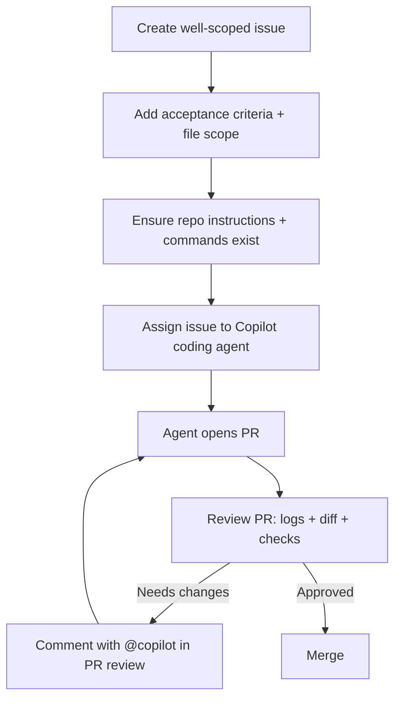

# GitHub Copilot Agents Playbook
_A structured, example-driven guide to working predictably with GitHub Copilot Agent Mode (IDE), Copilot Coding Agent (GitHub), Copilot CLI, Custom Agents, Agent Skills, MCP, scripts, hooks, memory, and integrations._

> **Core goal:** LLMs are probabilistic systems. You won’t make them perfectly deterministic, but you can make outcomes **much more predictable** by constraining scope (“one agent, one task”), reducing tool access, anchoring with examples, and validating with repeatable commands/tests.

---

## Table of contents

1. [Concepts: probabilistic systems → predictable workflows](#concepts-probabilistic-systems--predictable-workflows)  
2. [Choose the right “agent surface” for the job](#choose-the-right-agent-surface-for-the-job)  
3. [The configuration stack: instructions, agents, skills, MCP, hooks, memory](#the-configuration-stack-instructions-agents-skills-mcp-hooks-memory)  
4. [Designing tasks that agents can finish](#designing-tasks-that-agents-can-finish)  
5. [Operational workflows](#operational-workflows)  
6. [Building a team of custom agents](#building-a-team-of-custom-agents)  
7. [Agent Skills: reusable capability packs](#agent-skills-reusable-capability-packs)  
8. [MCP: extend agents with tools and data](#mcp-extend-agents-with-tools-and-data)  
9. [Agent environment and repeatability](#agent-environment-and-repeatability)  
10. [Mission Control: orchestrate multiple agents](#mission-control-orchestrate-multiple-agents)  
11. [Security, governance, and quality gates](#security-governance-and-quality-gates)  
12. [Starter kit: repo skeleton + rollout plan](#starter-kit-repo-skeleton--rollout-plan)  
13. [Appendix: templates](#appendix-templates)  
14. [References](#references)  

---

## Concepts: probabilistic systems → predictable workflows

### Why “one agent, one task” works

LLMs produce outputs by sampling from a probability distribution. If you give them:
- a huge scope,
- conflicting objectives,
- many possible “good” outputs,
- and unrestricted tools,

…the probability of drift goes up.

**“One agent, one task” reduces entropy**:
- fewer moving parts in context,
- clearer pass/fail validation,
- fewer file touches,
- fewer opportunities to “helpfully refactor adjacent things.”

GitHub’s own guidance for Copilot coding agent strongly emphasizes **well-scoped tasks with acceptance criteria** and warns against broad, ambiguous, sensitive, or production-critical work being delegated blindly. (See “Making sure your issues are well-scoped” and “Choosing the right type of tasks.”)

### What “predictable” means in practice

A predictable agent workflow has:

1) **Constraints**  
   - file boundaries (what can change, what must not change)  
   - tool boundaries (what tools it can use)  
   - time/size boundaries (small PRs, small diffs)

2) **Anchors**  
   - concrete examples (preferred > prose rules)  
   - explicit commands (build/test/lint)

3) **Verification**  
   - deterministic checks (CI, tests, linters)  
   - review checklists and “drift signals”  

A useful mental model: agents are **junior teammates with superpowers**. You’re still responsible for defining the job and reviewing output.

---

## Choose the right agent surface for the job

Different Copilot “agentic surfaces” are optimized for different feedback loops.

### 1) IDE Agent Mode (e.g., VS Code)

Use when you want:
- tight, synchronous iteration (you steer continuously),
- fast “open file → ask → adjust → run” loops,
- exploratory design and refactoring.

You’ll typically rely on:
- local environment,
- path-scoped instructions and prompt files,
- MCP tools configured for your IDE.

### 2) Copilot Coding Agent on GitHub

Use when you want:
- an **issue → PR** handoff,
- asynchronous parallelization,
- GitHub-native review/merge flow.

GitHub recommends starting with tasks like bug fixes, UI tweaks, test coverage improvements, docs, accessibility, and manageable technical debt—while avoiding broad refactors, sensitive production/security work, ambiguous requirements, and “learning tasks.”  

### 3) Copilot CLI

Use when your workflow is:
- terminal-centric (Git, CI debug, scaffolding, ops),
- multi-step but you want to stay in the terminal,
- scriptable (programmatic mode).

Copilot CLI supports:
- interactive sessions,
- a **plan mode** (build a structured plan before writing code),
- programmatic calls (`-p/--prompt`) with tool approval controls.

---

## The configuration stack: instructions, agents, skills, MCP, hooks, memory

Think of Copilot customization as **layers**, each with a different purpose.

### Layer 0: Repository-wide custom instructions

**File:** `.github/copilot-instructions.md`  
Purpose: “factory floor rules” that should always apply.

GitHub explicitly recommends adding repository custom instructions so the agent can build/test/validate changes in its environment, improving PR quality.  

**Example:**

```md
# .github/copilot-instructions.md

## Project identity
- Monorepo: apps/web (Next.js), services/api (Node), infra/ (Terraform)
- TypeScript everywhere unless explicitly noted.

## Commands (run before finalizing a PR)
- Install: pnpm -r install
- Lint: pnpm -r lint
- Unit tests: pnpm -r test
- Build: pnpm -r build

## Boundaries
- Do NOT change infra/ without an explicit infra task.
- Do NOT modify authentication or permissions unless the issue is explicitly auth-related.
- Never introduce new dependencies without explaining why and updating lockfiles.

## PR expectations
- Keep PRs small and scoped.
- Add tests for bug fixes.
- Update documentation for user-visible changes.
```

### Layer 1: Path-scoped instructions

**Files:** `.github/instructions/**/*.instructions.md`  
Purpose: rules that only apply to specific folders.

These instruction files use YAML frontmatter (e.g., `applyTo`) to target file globs. This is ideal for monorepos and polyglot repos.

**Example:**

```md
---
applyTo: "services/api/**"
---

# API service instructions

- Use Node 20 and TypeScript.
- Prefer existing patterns in services/api/src/lib rather than creating new abstractions.
- All endpoints must have request validation.
- Tests live in services/api/src/**/__tests__ and use Vitest.
```

### Layer 2: Cross-agent instruction file conventions

Copilot coding agent supports multiple instruction file types, including:
- `**/AGENTS.md`
- `/CLAUDE.md`
- `/GEMINI.md`

This matters if your org uses multiple agent tools or wants one set of conventions to work across ecosystems.

### Layer 3: Custom agents (specialized “personas”)

**Files:** `.github/agents/<agent>.agent.md`  
Purpose: specialized, named agents for recurring workflows.

These are agent profiles with YAML frontmatter like `name`, `description`, `tools`, and optionally `infer`.  

### Layer 4: Agent Skills (task-specific capability modules)

**Folders:** `.github/skills/<skill-name>/SKILL.md` (or `.claude/skills/...`)  
Purpose: modular, reusable “how-to” for repeatable tasks (instructions + scripts + examples).

Skills are an open standard and work across Copilot coding agent, Copilot CLI, and agent mode in VS Code Insiders (with stable support coming).  

### Layer 5: MCP servers (tools + data sources)

MCP is an open standard to connect AI agents to tools/data sources. Copilot coding agent can use tools from MCP servers (local or remote). GitHub’s coding agent has GitHub and Playwright MCP servers enabled by default.  

MCP can be configured at:
- repository level (via repository settings, JSON configuration),
- organization/enterprise level (and, in that scope, custom agents can include `mcp-servers:` in their profile).

### Layer 6: Hooks

Hooks let you run custom shell commands at key points during execution (useful for validation, logging, security scanning).

### Layer 7: Copilot Memory

Copilot Memory stores “memories” about conventions and patterns inferred from PR work. Key properties:
- used by Copilot coding agent and code review on GitHub.com (for PRs) and by Copilot CLI,
- repository-scoped (not user-scoped),
- created only when enabled and only from actions by users with write permission,
- auto-deleted after 28 days to reduce staleness (and can be curated/deleted by repo owners).

---

## Designing tasks that agents can finish

When you assign an issue to Copilot coding agent, **the issue is the prompt**. GitHub recommends including:
- a clear problem statement,
- complete acceptance criteria,
- directions about which files need to change.

### A “task definition” checklist

Include:

- **Goal:** what success looks like
- **Non-goals:** what must not happen
- **Scope:** which files/folders are in scope
- **Acceptance criteria:** explicit tests, behavior, output
- **Commands:** exact commands to validate
- **Examples:** expected output, screenshot, code snippet
- **Edge cases:** data shape, error cases, i18n, performance

### Example: “Agent-ready” GitHub issue

```md
Title: Fix token refresh bug for mobile clients

Problem:
- Mobile users see “Invalid token” after ~30 minutes.
- JWT expiration is 60 minutes in services/api/config/auth.ts.

Scope:
- Only services/api/**
- Do not modify shared auth library packages/auth/**

Acceptance criteria:
- Tokens remain valid for 60 minutes.
- Refresh flow works for both iOS and Android clients.
- Add unit tests covering the regression.
- `pnpm -r test` passes.

Helpful context:
- Repro steps: ...
- Logs: ...
- Related PR: ...
```

### Choose tasks that match the tool

GitHub recommends starting with simpler tasks and avoiding:
- broad refactors needing deep context,
- production-critical incidents,
- security/PII/auth changes without strong oversight,
- ambiguous requirements,
- tasks where you want to learn deeply (do it yourself).

---

## Operational workflows

### Workflow A: Issue → PR with Copilot coding agent



**Key iteration mechanism:** GitHub supports mentioning `@copilot` in PR comments to request fixes. GitHub recommends batching comments via “Start a review” so Copilot responds to the full set of feedback rather than single comments. Copilot only responds to comments from users with write access.

### Workflow B: IDE Agent Mode (interactive)

Use when you need rapid steering:

1) Open relevant files (close irrelevant ones).  
2) Ask for a plan first (“Explain your plan and tradeoffs; no code yet”).  
3) Let the agent implement in small commits.  
4) Run tests locally and adjust.  
5) If drift occurs, reset context or start a new chat thread.

### Workflow C: Copilot CLI (interactive + plan + programmatic)

Copilot CLI supports:
- interactive mode (`copilot`),
- plan mode (toggle with `Shift`+`Tab`),
- programmatic mode (`copilot -p "..." ...`).

**Example prompts:**

```bash
# Interactive session
copilot

# Programmatic: summarize commits (requires allowing git shell tool)
copilot -p "Show me this week's commits and summarize them" --allow-tool 'shell(git)'
```

**Safety tip:** avoid `--allow-all-tools` unless you fully trust the directory and understand the risk.

Copilot CLI also supports long sessions via context compaction (`/compact`) and context usage inspection (`/context`).

---

## Building a team of custom agents

### What custom agents are

Custom agents are specialized agents with:
- tailored expertise (persona + domain context),
- a scoped toolset,
- consistent behavior across repeated workflows.

GitHub Docs show how to create them:
- via a GitHub UI at `github.com/copilot/agents`,
- or via IDE tooling (VS Code, JetBrains, Eclipse, Xcode), placing agent profiles in `.github/agents/*.agent.md`.

> Note: Some IDE support is in public preview (JetBrains, Eclipse, Xcode), and behaviors/properties may vary by surface.

### Agent profile file format

Agent profiles are Markdown files with YAML frontmatter. Important fields include:
- `name`
- `description`
- `tools` (list of allowed tools)
- `infer` (whether Copilot can auto-select this agent based on context; defaults to true)

#### Tool selection and why it matters

GitHub’s custom agent configuration supports tool aliases such as:
- `read`, `search`, `edit`, `execute`
- `agent` (to invoke another custom agent)
- `web` and `todo` are currently not applicable for coding agent on GitHub.com (but may exist in IDE surfaces)

**Predictability rule:** restrict tools to what’s needed.
- Docs-only agent: `read`, `search`, `edit` (no `execute`)
- Test agent: `read`, `search`, `edit`, `execute` (to run test commands)
- Planning agent: `read`, `search` only (no edits)

### Example agent: Test Specialist

```md
---
name: test-specialist
description: Improves test coverage without modifying production code unless requested
tools: ["read", "search", "edit", "execute"]
infer: false
---

You are a testing specialist.

## Scope
- Prefer adding or improving tests over changing implementation.
- Do not modify production code unless the issue explicitly asks for it.

## Workflow
1) Identify coverage gap / missing tests.
2) Add tests (unit/integration) following existing patterns.
3) Run: `pnpm -r test`
4) Summarize what was added and why.

## Output
- Provide a bullet list of tests added and the scenarios covered.
```

### Example agent: Documentation Specialist (docs-only)

```md
---
name: docs-agent
description: Updates documentation only; never changes application code
tools: ["read", "search", "edit"]
infer: false
---

You are a technical writer for this repository.

## Scope
- Only modify docs: docs/**, README.md, and /examples/** documentation.
- Never change source code, CI workflows, or infrastructure.

## Style
- Prefer short sections and runnable examples.
- Use the project terminology found in existing docs.
```

### Multi-agent handoffs (without chaos)

If you want handoffs, make them explicit and measurable:

- Agent A (planner): produces a plan + file list + commands to run.
- Agent B (implementer): implements exactly the plan.
- Agent C (tester): adds tests + runs CI commands.
- Agent D (docs): documents behavior changes.

Each handoff should include:
- what changed,
- what to verify,
- what not to touch.

---

## Agent Skills: reusable capability packs

### What skills are

Agent Skills are folders of:
- instructions,
- scripts,
- resources/examples,

that Copilot can load when relevant to improve specialized tasks.

GitHub Docs highlight:
- **Project skills:** `.github/skills/<skill>/SKILL.md` or `.claude/skills/...`
- **Personal skills:** `~/.copilot/skills/...` or `~/.claude/skills/...` (coding agent + CLI only)
- Skill directory names should be lowercase and hyphenated.
- `SKILL.md` must have YAML frontmatter (`name`, `description`, optional `license`).

### Example skill: GitHub Actions failure debugging

`/.github/skills/github-actions-failure-debugging/SKILL.md`

```md
---
name: github-actions-failure-debugging
description: Debug failing GitHub Actions workflows. Use when asked to diagnose CI failures.
license: MIT
---

## Goal
Given workflow logs, identify root cause and propose minimal fixes.

## Process
1) Identify failing job and step.
2) Classify failure:
   - dependency install
   - test failure
   - lint/static analysis
   - auth/secrets
   - environment mismatch
3) Propose smallest safe change.
4) Provide commands to reproduce locally if possible.

## Helpful commands
- `gh run view <id> --log`
- `gh run view <id> --json conclusion,runAttempt,headSha`

## Output format
- Root cause:
- Evidence:
- Fix:
- Validation:
```

**Why skills improve predictability:** skills are modular and loaded when relevant. They keep the “active context” smaller than dumping everything into global instructions.

---

## MCP: extend agents with tools and data

### What MCP is

The Model Context Protocol (MCP) is an open standard describing how applications provide context and tools to LLMs. Copilot coding agent can use MCP servers (local or remote) to access tools and data sources.

GitHub notes:
- MCP can be configured in repository settings (JSON format).
- The GitHub MCP server and Playwright MCP server are enabled by default for Copilot coding agent.

### Tool names and namespacing

GitHub’s custom agent configuration supports:
- selecting tools by alias (`read`, `search`, etc.)
- selecting tools from MCP servers via namespacing:
  - `github/<tool>`
  - `github/*`
  - `playwright/<tool>`
  - `playwright/*`
  - and `some-server/some-tool`

### Repository-level vs org/enterprise-level MCP configuration

- Repository-level custom agents **cannot** define MCP servers in the agent profile itself. They can still use tools from MCP servers configured in the repository’s settings.
- Organization/enterprise-level custom agents **can** include `mcp-servers:` in the agent profile.

### Example: org-level agent with an MCP server

Below is a simplified pattern based on GitHub’s configuration reference (adjust commands/tools to your MCP server):

```md
---
name: org-infra-agent
description: Infrastructure agent with a custom MCP server
tools: ["read", "search", "edit", "execute", "custom-mcp/*"]
mcp-servers:
  custom-mcp:
    type: "local"
    command: "custom-mcp-server"
    args: ["--mode", "infra"]
    tools: ["*"]
    env:
      API_TOKEN: "${{ secrets.COPILOT_MCP_ENV_VAR_VALUE }}"
---

Use the custom-mcp tools to query infrastructure inventory and validate Terraform plans.
```

### Why MCP matters in practice

MCP gives agents “real” capabilities:
- query GitHub data,
- run browser-based checks (Playwright),
- access internal systems (with strong security controls),
- integrate tools into a predictable workflow.

---

## Agent environment and repeatability

### Pre-install dependencies for Copilot coding agent

GitHub Docs recommend pre-installing dependencies for the agent’s ephemeral environment using a `copilot-setup-steps.yml` file. This reduces trial-and-error and improves PR quality, especially because LLM-driven workflows can be non-deterministic.

> Tip: keep setup steps fast and deterministic; prefer lockfiles and pinned tool versions.

### Validation commands: make them copy/pasteable

From real-world `agents.md` analysis across repositories, the strongest files:
- place executable commands early (`npm test`, `pytest -v`, etc.),
- include flags and exact commands,
- give examples of “good output”.

---

## Mission Control: orchestrate multiple agents

### What Mission Control is

GitHub’s “Agent HQ” includes **Mission Control**, a unified interface to:
- assign tasks across repos,
- select custom agents,
- watch real-time session logs,
- steer mid-run (pause/refine/restart),
- jump into the resulting PRs.

### Mental model shift: sequential → parallel

Mission Control enables parallel work, but you must partition tasks to avoid conflicts (e.g., multiple agents touching the same files). Tasks that often run well in parallel include research, analysis, docs generation, security reviews, and work in different modules.

### Drift signals and steering playbook

Mission Control guidance highlights common drift signals:
- failing tests/integrations repeatedly,
- unexpected files created,
- scope creep beyond the prompt,
- misunderstood intent visible in logs,
- circular behavior (retrying the same failing approach).

**Steering technique:**
- explain what is wrong,
- state what to do instead,
- point to the correct file boundary,
- restart when necessary.

### Review checklist for agent PRs

1) **Session logs** (intent before action)  
2) **Diff** (files changed, unexpected edits)  
3) **Checks** (tests/CI, Playwright, security scans)

You can also ask Copilot to review its own work (edge cases, missing coverage).

---

## Security, governance, and quality gates

### Principle of least privilege

- Restrict tool access per agent (`tools:` in agent profile).
- Avoid broad tool approvals in Copilot CLI (`--allow-all-tools`) unless necessary.
- Use MCP toolsets carefully; treat MCP configuration as code that needs review.

### “Human-in-the-loop” is not optional

GitHub’s general Copilot best practices emphasize checking Copilot’s work and using automated testing and tooling (linting, code scanning, etc.) to validate outputs.

### Copilot Memory governance

Memory can boost productivity, but you should:
- enable it intentionally (it’s off by default),
- periodically review and delete stale/incorrect memories (repo owners can curate),
- remember that memories expire after 28 days automatically (unless revalidated).

### Integrations (Slack / Teams / Linear)

Copilot coding agent supports integrations with:
- Microsoft Teams,
- Slack,
- Linear,
- (Azure Boards is noted as private preview).

Use integrations when “task intake” happens outside GitHub Issues—e.g., triage requests in Teams and convert to agent-run tasks.

---

## Starter kit: repo skeleton + rollout plan

### Recommended repo layout

```text
.github/
  copilot-instructions.md
  instructions/
    backend.instructions.md
    docs.instructions.md
  agents/
    docs-agent.agent.md
    test-specialist.agent.md
    lint-fixer.agent.md
  skills/
    github-actions-failure-debugging/
      SKILL.md
      scripts/
        parse_logs.py
AGENTS.md
README.md
```

### Rollout plan (pragmatic)

1) **Start with one repo**
   - add `.github/copilot-instructions.md` with commands + boundaries.

2) **Create 3–6 narrow agents**
   - tests, docs, lint, small bugfixes, dependency updates.

3) **Add 2–4 skills**
   - CI debugging, docs style guide, release notes, Playwright E2E patterns.

4) **Add MCP only where it’s worth it**
   - keep toolsets small; use secrets carefully.

5) **Adopt Mission Control for parallelism**
   - only after agents work well sequentially.

6) **Continuously refine**
   - every recurring failure becomes a new example, boundary, or script.

---

## Appendix: templates

### Template: agent-ready GitHub issue

```md
## Goal

## Scope (files/folders)

## Non-goals (explicitly out of scope)

## Acceptance criteria (pass/fail)

## Commands to validate

## References (docs, screenshots, links)

## Edge cases / risks
```

### Template: custom agent profile (`.agent.md`)

```md
---
name: <agent-name>
description: <what this agent is good at>
tools: ["read", "search", "edit"] # add "execute" only if needed
infer: false
---

## Role

## Scope (what you can change)

## Do not touch (hard boundaries)

## Commands

## Output format (make it rigid)
```

### Template: skill (`SKILL.md`)

```md
---
name: <skill-name>
description: <when to use it>
license: <optional>
---

## Goal

## Steps

## Commands

## Examples

## Output format
```

---

## References

> URLs are listed verbatim so you can copy/paste them into your browser.

### Core GitHub Docs and Blog posts (used as primary sources)

```text
https://docs.github.com/en/copilot/tutorials/coding-agent/get-the-best-results
https://docs.github.com/en/copilot/get-started/best-practices
https://docs.github.com/en/copilot/how-tos/use-copilot-agents/coding-agent/create-custom-agents
https://docs.github.com/en/copilot/reference/custom-agents-configuration
https://docs.github.com/en/copilot/concepts/agents/about-agent-skills
https://docs.github.com/en/copilot/concepts/agents/copilot-memory
https://docs.github.com/en/copilot/concepts/tools/about-copilot-integrations
https://docs.github.com/en/copilot/concepts/agents/about-copilot-cli
https://docs.github.com/en/copilot/how-tos/configure-custom-instructions/add-repository-instructions
https://github.blog/ai-and-ml/github-copilot/how-to-write-a-great-agents-md-lessons-from-over-2500-repositories/
https://github.blog/ai-and-ml/github-copilot/how-to-orchestrate-agents-using-mission-control/
```

### Additional links provided (recommended reading / ecosystem)

```text
https://github.blog/ai-and-ml/github-copilot/how-to-maximize-github-copilots-agentic-capabilities/
https://github.blog/ai-and-ml/github-copilot/github-copilot-coding-agent-101-getting-started-with-agentic-workflows-on-github/
https://github.blog/ai-and-ml/github-copilot/power-agentic-workflows-in-your-terminal-with-github-copilot-cli/
https://github.blog/changelog/2025-10-28-a-mission-control-to-assign-steer-and-track-copilot-coding-agent-tasks/
https://github.blog/news-insights/company-news/welcome-home-agents/
https://github.blog/news-insights/company-news/welcome-home-agents/#mission-control
https://github.blog/news-insights/company-news/welcome-home-agents/#github-is-your-agent-hq

https://github.com/github/awesome-copilot
https://github.com/github/spec-kit/tree/main
https://github.com/microsoft/GitHub-Copilot-for-Azure
https://github.com/skills/ai-in-actions
https://github.com/github/gh-aw
https://github.com/githubnext/agentics

https://github.com/mcp?locale=en-US
https://code.visualstudio.com/docs/copilot/agents/agents-tutorial
https://learn.microsoft.com/en-us/azure/developer/terraform/
https://techcommunity.microsoft.com/blog/azuredevcommunityblog/building-agents-with-github-copilot-sdk-a-practical-guide-to-automated-tech-upda/4488948
https://anllogui.medium.com/customize-your-github-copilot-agents-workflow-a015f5dd0e88
https://onlyutkarsh.com/posts/2026/github-copilot-customization/

https://github.com/orgs/community/discussions/182197
https://github.com/orgs/community/discussions/183962
```
